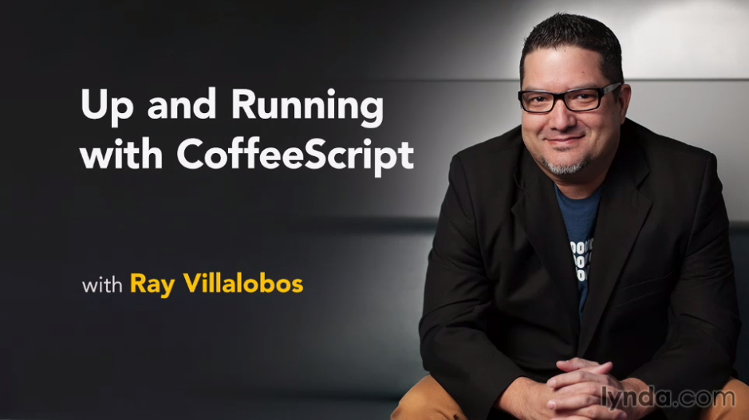

# Up and Running with CoffeeScript

This is the repository for my course, [Up and Running with CoffeeScript](http://www.lynda.com/Developer-Web-Design-tutorials/Up-Running-CoffeeScript/154415-2.html). The full course is available at [lynda.com](http://lynda.com).

## Course Description
Learning CoffeeScript allows front-end developers to write JavaScript more beautifully and efficiently. It gives your code an extra zing. This course teaches the best features from the CoffeeScript language, like splats and ranges, plus how to write common JavaScript commands more efficiently using CoffeeScript. Author Ray Villalobos also shows how to work with Gulp.js, a streaming build system for not only CoffeeScript, but also Sass, LESS, JavaScript, and CSS.

## Topics include:
- What is CoffeeScript?
- Setting up a project with Gulp.js
- Adding CoffeeScript to your workflow
- Dealing with array ranges
- Working with conditional statements
- Using loops
- Working with splats